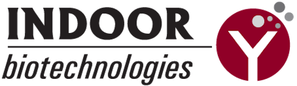

# Mobile / Frontend Engineer Specializing in Biotech + Health Applications

I build [mobile apps](https://apps.apple.com/app/allergen-guru/id1373922308) and [web apps](https://depmap.org/portal/) for biotech/health tech companies. 

Notebooks and spreadsheets are powerful tools, but they aren't production ready software. That gap is filled with App Store approvals, load balancers and worst of all, javascript frameworks.

---

I know what it's like to wake up at 4 a.m. to dose mice - and how frustrating it can be when you don't have the right software on hand.

**Your job is to plan, execute, and communicate good science.**

*Writing, deploying, and maintaining software is mine.*

---

# History

 | 
AllergenGuru partners with the WHO to provide up-to-date information about allergens to food scientists. | Project Hermes guides and tracks post-hip replacement patients through curated physical therapy, without them having to leave their home.
 | 

# Background

I've worked the bench and the vivarium in a Pancreatic Cancer lab - and **gained a lot of empathy for research scientists in the process**.

I'm a curious and driven engineer. I love working in biotech - whether that's building tools for research scientists, helping physicians make more informed decisions, or handing patients the tools to help themselves.

# Technical

The bulk of my experience is with `python` and `javascript` frameworks.

The tech stack I reach for most often is `React/React Native`, `Flask`, and either `GCP` or `Firebase` depending on scope.

I am more experienced with `GCP` through my work at the Broad Institute of MIT and Harvard, but I gained familiarity with `AWS` while working at Capital One.

I am familiar with native mobile development, though I find for most applications `React Native`'s boost to development speed to be worth the tradeoffs.

# Contact
	
 - [Email](mailto:me@nishantjha.org)
 - [Website](https://nishantjha.org/)
 - [Resume](https://nishantjha.org/resume.pdf)
 - [LinkedIn](https://linkedin.com/in/ninjha01/)
 - [GitHub](https://github.com/ninjha01/)

# Personal

I like to cook and play tennis. If you want to taste-test my from-scratch naan or improve my one handed backhand [send me an email](mailto:me@nishantjha.org).

I also love to read! I read 44 books in 2019, and would love book recommendations.
