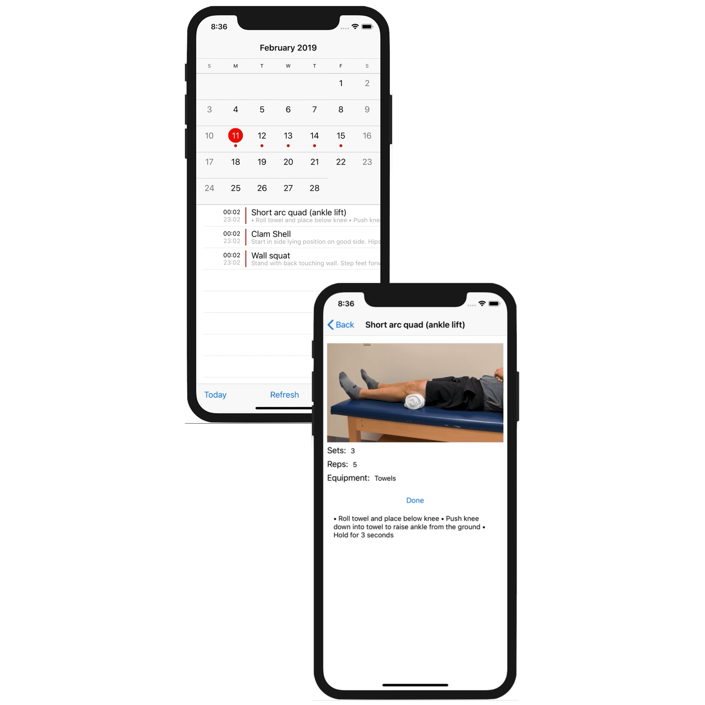

# What I Do

I build [mobile apps](https://apps.apple.com/app/allergen-guru/id1373922308) and [websites](https://depmap.org/portal/) for biotech/health tech companies!

 | 
AllergenGuru partners with the WHO to provide up-to-date information about allergens to food scientists. | Project Hermes guides and tracks post-hip replacement patients through curated physical therapy, without them having to leave their home.

The apps are cross platform and I'm cross disciplinary.

I have a deep interest in biology and thrive in a hard science environment.

---

I know what it's like to wake up at 4am to dose mice - and how frustrating it can be when you don't have the right software on hand.

**Your job is to plan, execute, and communicate good science.**

*Writing, deploying, and maintaining software is mine.*

# Contact

Check out [my resume](https://nishantjha.org/resume.pdf) and [send me an email](mailto:me@nishantjha.org).

# Background

🧪 I'm passionate about Biology! 🧬

I majored in Computer Science, but I also finished the entire Pre-Med courseload (and learned enough to score in **the top 3%** on the MCAT). 

All of that was done in the first three years of college, I crammed a 2 year Master's degree into my fourth. Along the way I worked the bench and the vivarium in a Pancreatic Cancer lab - and **gained a lot of empathy for research scientists in the process**.

Credentials aside, I'm a curious and driven engineer. I love working in biotech - whether that's building tools for research scientists, helping physicians make more informed decisions, or handing patients the tools to help themselves.

# Technical

I am [TripleByte certified.](https://triplebyte.com/certificate/YAiPxpq)

The bulk of my experience is with `python` and `javascript` frameworks.

The tech stack I reach for most often is `React/React Native`, `Flask`, and either `GCP` or `Firebase` depending on scope.

I am more experienced with `GCP` through my work at the Broad Institute of MIT and Harvard, but I gained familiarity with `AWS` while working at Capital One.

I am familiar with native mobile development, though I find for most applications `React Native`'s boost to development speed to be worth the tradeoffs.

# Web Presence

 - [LinkedIn](https://linkedin.com/in/ninjha01/)
 - [GitHub](https://github.com/ninjha01/)

# Personal

AFK, I like to cook and play tennis! If you want to taste-test my from-scratch naan or improve my one handed backhand [send me an email](mailto:me@nishantjha.org).

I also love to read! I read 44 books in 2019, and would love book reccomendations.
